# ⚡ Axiom — College Management System


[](https://college-management-system-gules-three.vercel.app/)
[](https://reactjs.org/)
[](https://nodejs.org/)
[](https://railway.app/)
[](https://capacitorjs.com/)
[](https://www.electronjs.org/)
[](https://web.dev/progressive-web-apps/)
[](./LICENSE)

**Axiom** is a full-stack, multi-platform college management system built for **Government College of Engineering, Keonjhar**. It runs as a web app, Android app, desktop (Electron) app, and installable PWA — all from a single codebase.

**[🔗 Live Demo](https://college-management-system-gules-three.vercel.app/)** · [📋 Features](#-features) · [🏗️ Architecture](#️-architecture) · [🚀 Setup](#-setup-guide) · [👥 Team](#-team)

---


## 📌 Overview

Axiom replaces manual administrative workflows — paper attendance sheets, printed mark sheets, and fragmented record-keeping — with a unified digital platform accessible from any device.

The system supports **three distinct user roles** (Admin, Faculty, Student), each with a tailored dashboard and access-controlled features. It is deployed across **three separate services** for reliability and scalability, and ships as a **native Android app**, **Electron desktop app**, and **PWA** alongside the standard web interface.

> Built with React + Node.js + MySQL. Deployed on Vercel + Render + Railway.

---

## ✨ Features

<details>
<summary>🛡️ Admin Portal</summary>

| Feature | Description |
|---|---|
| **Dashboard** | College-wide stats — total students, faculty, and courses at a glance |
| **Student Management** | Add, view, edit, and delete student records with full personal details |
| **Faculty Management** | Manage faculty accounts, qualifications, experience, and subject assignments |
| **Import Students via Excel** | Bulk-create student accounts from `.xlsx` with downloadable template (Android-aware file handling) |
| **Import Faculty via Excel** | Bulk-create faculty accounts from `.xlsx` files |
| **Import Marks via Excel** | Bulk upload marks per subject with a downloadable pre-filled template |
| **Course Management** | Create courses supporting both Semester and Year based systems |
| **Subject Management** | Define subjects with theory and practical max marks per course and semester |
| **Assign Subjects** | Map subjects to faculty members per course and semester |
| **Take Attendance** | Mark student attendance per subject and date |
| **Edit Attendance** | Correct previously recorded attendance for any date |
| **Enter Marks** | Record internal theory and practical marks per subject |
| **Edit Marks** | Update previously entered marks |
| **Attendance Report** | Subject-wise attendance with percentage analytics per student |
| **Marks Report** | Subject-wise marks with average, highest, and lowest summary |
| **Print Marksheet** | Generate cryptographically verified A4 marksheets with QR code, watermark, SVG seal, and signature |
| **Admin Profile** | Manage college name, logo, contact details, social media links, and signature |

</details>

<details>
<summary>👨‍🏫 Faculty Portal</summary>

| Feature | Description |
|---|---|
| **Dashboard** | Overview of total students, faculty, and subjects |
| **Take Attendance** | Mark attendance for assigned subject — restricted to today's date (enforced server-side) |
| **Edit Attendance** | Correct attendance entries for today only — server-side enforced |
| **Enter Marks** | Enter internal marks for assigned subject |
| **Attendance Report** | Subject-wise attendance analytics for assigned class |
| **Marks Report** | View marks report for assigned subject |
| **Faculty Profile** | View and update personal profile and photo |

</details>

<details>
<summary>👨‍🎓 Student Portal</summary>

| Feature | Description |
|---|---|
| **Dashboard** | Personal info — name, roll number, course, and semester |
| **Attendance Tracker** | Subject-wise attendance with total classes, attended count, and percentage |
| **Marksheet** | View internal marks — theory, practical, and total per subject |
| **Student Profile** | Update password and date of birth |

</details>

---

## 🖥️ Multi-Platform Support

A **single codebase** that ships to four platforms:

| Platform | Technology | Status |
|---|---|---|
| **Web App** | React + Vite, deployed on Vercel | ✅ Live |
| **Android App** | Capacitor 8 — native Android wrapper | ✅ Built |
| **Desktop App** | Electron — Windows / macOS / Linux | ✅ Built |
| **PWA** | Web App Manifest + Service Worker | ✅ Installable |

---

## 🔐 Authentication & Security

| Feature | Description |
|---|---|
| **Email + Password** | JWT-based login with bcrypt password hashing |
| **Google OAuth** | One-click sign-in via Google — web, Android, and Electron each handled separately |
| **Role-based Access Control** | Middleware-enforced per-role access on every API route |
| **Faculty Attendance Restriction** | Faculty can only submit attendance for today's date — enforced server-side |
| **Last Login Tracking** | Login timestamps recorded per user in the database |
| **Active / Inactive Status** | Per-user active status tracked for admin, faculty, and students |
| **SHA-256 Marksheet Verification** | Every marksheet carries a cryptographic hash of the student's marks data |
| **QR Code Verification** | Scan QR on any printed marksheet to verify its authenticity |
| **Offline Detection** | PWA-aware — detects when app loads from cache but backend is unreachable, shows graceful retry dialog |
| **Dark / Light Mode** | System-preference aware, persisted in localStorage |

---

## 🔒 Role & Access Matrix

<details>
<summary>Click to expand</summary>

| Feature | Student | Faculty | Admin |
|---|---|---|---|
| View own attendance | ✅ | ✅ | ✅ |
| Take attendance | ❌ | ✅ today only | ✅ |
| Edit attendance | ❌ | ✅ today only | ✅ |
| View own marks | ✅ | ✅ | ✅ |
| Enter marks | ❌ | ✅ | ✅ |
| Edit marks | ❌ | ✅ | ✅ |
| Import marks via Excel | ❌ | ❌ | ✅ |
| Print marksheet | ✅ | ❌ | ✅ |
| Verify marksheet via QR | ✅ | ✅ | ✅ |
| Manage students | ❌ | ❌ | ✅ |
| Manage faculty | ❌ | ❌ | ✅ |
| Import students / faculty via Excel | ❌ | ❌ | ✅ |
| Manage courses & subjects | ❌ | ❌ | ✅ |
| Assign subjects to faculty | ❌ | ❌ | ✅ |
| Manage college profile | ❌ | ❌ | ✅ |

</details>

---

## 🏗️ Architecture

<details>
<summary>Click to expand</summary>

```
axiom/
│
├── backend/                         ← Node.js + Express REST API
│   ├── src/
│   │   ├── controllers/             ← 14 controllers
│   │   ├── routes/                  ← 14 route files
│   │   ├── middleware/              ← JWT auth + role-based access control
│   │   └── config/                  ← MySQL connection
│   ├── uploads/                     ← Profile photos, college logo, signature
│   └── server.js
│
├── frontend/                        ← React + Vite SPA
│   ├── src/
│   │   ├── pages/
│   │   │   ├── Admin/               ← 20 pages + modals
│   │   │   ├── Faculty/             ← 8 pages
│   │   │   └── Student/             ← 5 pages
│   │   ├── components/              ← Reusable UI components
│   │   └── utils/                   ← Axios API client
│   ├── android/                     ← Capacitor Android project
│   ├── electron/                    ← Electron desktop app
│   └── public/                      ← PWA manifest, icons, screenshots
│
└── sql/
    └── schema.sql                   ← Full MySQL schema with foreign keys
```

### Deployment Architecture

```
User
 │
 ├── Web / PWA ──────────→ Vercel (Frontend)
 │                               │
 ├── Android App ───────────────→│
 │                               │
 └── Electron Desktop ──────────→│
                                 │
                                 ↓
                    Render (Express Backend) ←── keep-alive ping every 5 min
                                 │
                                 ↓
                    Railway (MySQL Database)
```

</details>

---

## 🗄️ Database Schema

<details>
<summary>Click to expand</summary>

| Table | Purpose |
|---|---|
| `admin` | College profile, logo, social links, credentials |
| `students` | Full student records including personal and family details |
| `faculties` | Faculty records with qualifications and subject assignments |
| `courses` | Courses with semester / year system support |
| `subject` | Subjects with theory and practical max marks |
| `attendance` | Date-wise attendance with unique constraint per student/subject/date |
| `marks` | Theory and practical marks per student per subject |
| `result` | Result declaration status per course/semester |
| `rollgenerator` | Auto roll number generation per course/semester |

</details>

---

## 🔖 Marksheet Verification System

<details>
<summary>Click to expand</summary>

Every marksheet generated by Axiom is cryptographically verifiable:

```
Generate Marksheet
       │
       ├── SHA-256 hash computed from student marks data (Web Crypto API)
       ├── Hash printed on the physical marksheet
       ├── QR code generated pointing to /verify/marksheet/:code
       ├── College logo watermark at 6% opacity
       ├── Circular SVG text seal around student photo
       └── Controller of Examinations signature image

Scan QR Code
       │
       └── Verification page confirms authenticity
           ├── Student name + Roll number
           ├── Course + Semester
           ├── SHA-256 hash
           └── ✅ Issued by GCE Keonjhar
```

</details>

---

## 🛠️ Tech Stack

| Layer | Technology |
|---|---|
| **Frontend** | React 19, React Router v7, Vite 7, TailwindCSS 4 |
| **Backend** | Node.js, Express 5 |
| **Database** | MySQL (hosted on Railway) |
| **Authentication** | JWT + bcrypt, Google OAuth 2.0 |
| **Android** | Capacitor 8 with Filesystem, Network, Browser plugins |
| **Desktop** | Electron 41 with electron-builder (Windows NSIS + Linux AppImage) |
| **PWA** | Vite PWA Plugin, Web App Manifest |
| **Marksheet** | QRCode.react, SHA-256 via Web Crypto API, jsPDF, html2canvas |
| **Excel Import/Export** | SheetJS (xlsx) + ExcelJS |
| **CI/CD** | GitHub Actions |
| **Frontend Hosting** | Vercel |
| **Backend Hosting** | Render (keep-alive ping to prevent cold starts) |
| **Database Hosting** | Railway |

---

## 🚀 Setup Guide

<details>
<summary>Click to expand</summary>

### Prerequisites

- Node.js v18+
- MySQL Server (or a Railway account)
- Git

---

### Step 1 — Clone the Repository

```bash
git clone https://github.com/AyusmanNanda/college-management-system.git
cd college-management-system
```

---

### Step 2 — Backend Setup

```bash
cd backend
npm install
```

Create a `.env` file inside `backend/`:

```env
DB_HOST=localhost
DB_USER=root
DB_PASSWORD=yourpassword
DB_NAME=collegedata
JWT_SECRET=your_jwt_secret
GOOGLE_CLIENT_ID=your_google_client_id
GOOGLE_CLIENT_SECRET=your_google_client_secret
FRONTEND_URL=http://localhost:5173
BASE_URL=http://localhost:5000
NODE_ENV=development
PORT=5000
```

Import the database schema:

```bash
mysql -u root -p collegedata < sql/schema.sql
```

Start the backend:

```bash
npm run dev
```

---

### Step 3 — Frontend Setup

```bash
cd ../frontend
npm install
```

Create a `.env` file inside `frontend/`:

```env
VITE_BACKEND=http://localhost:5000
VITE_GOOGLE_CLIENT_ID=your_google_client_id
VITE_FRONTEND=http://localhost:5173
```

Start the frontend:

```bash
npm run dev
```

Open your browser at **http://localhost:5173** ✅

---

### Default Admin Account

```
Email:    admin@gcekjr.ac.in
Password: admin123
```

---

### Android Build

```bash
cd frontend
npm run build
npx cap sync android
npx cap open android
```

Build and run via Android Studio.

---

### Desktop (Electron) Build

```bash
cd frontend
npm run build
npm run electron
```

</details>

---

## 🖼️ Screenshots

<details>
<summary>Click to expand</summary>

### 🔐 Login Page
| Light | Dark |
|---|---|
|  | 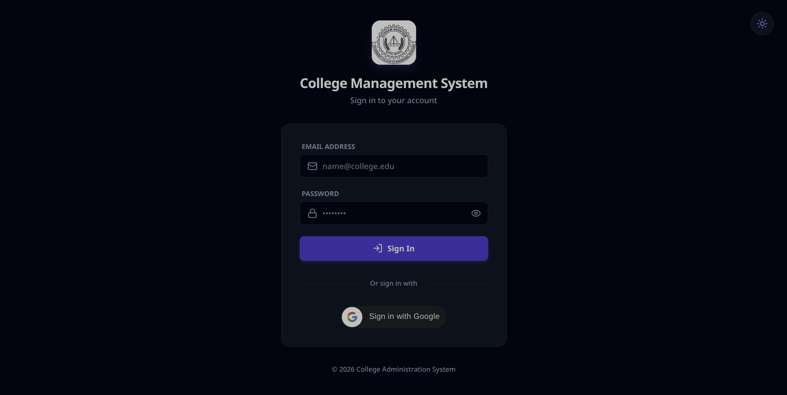 |
| 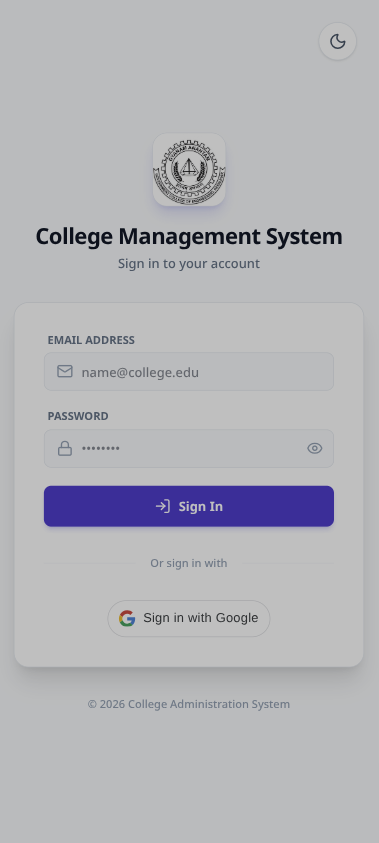 | 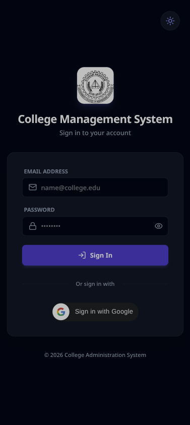 |

---

### 🛡️ Admin Portal
| Light | Dark |
|---|---|
| 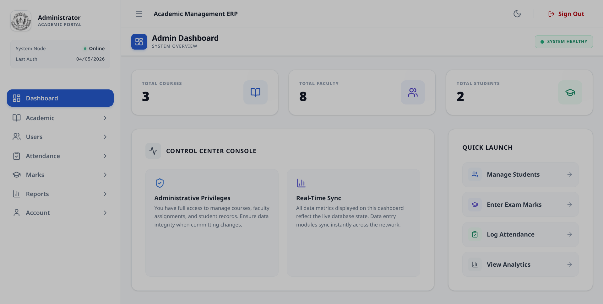 |  |
| 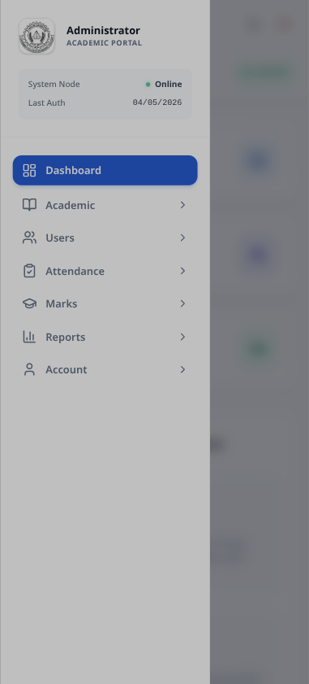 | 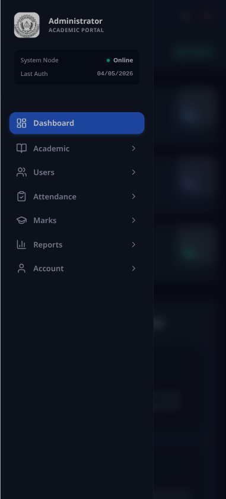 |

---

### 👨‍🏫 Faculty Portal
| Light | Dark |
|---|---|
| 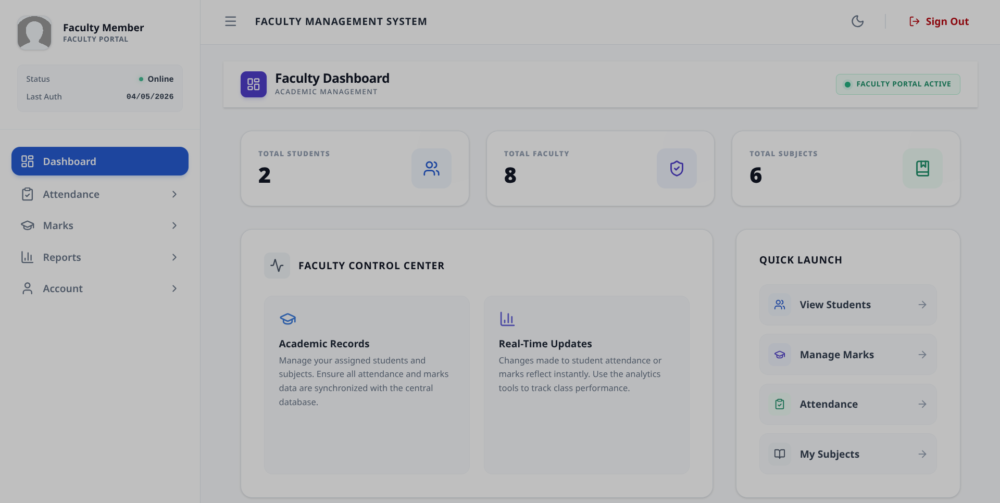 |  |
| 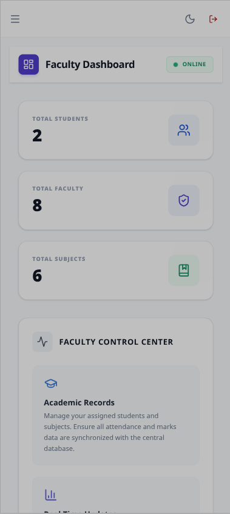 | 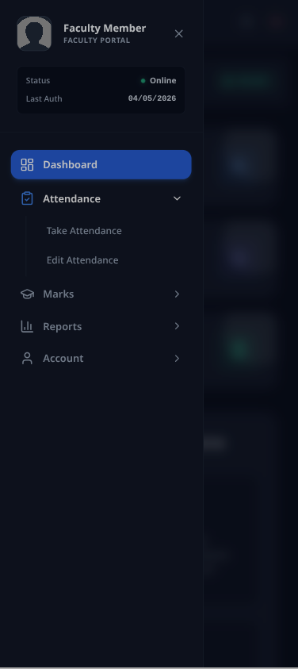 |

---

### 👨‍🎓 Student Portal
| Light | Dark |
|---|---|
|  |  |
| 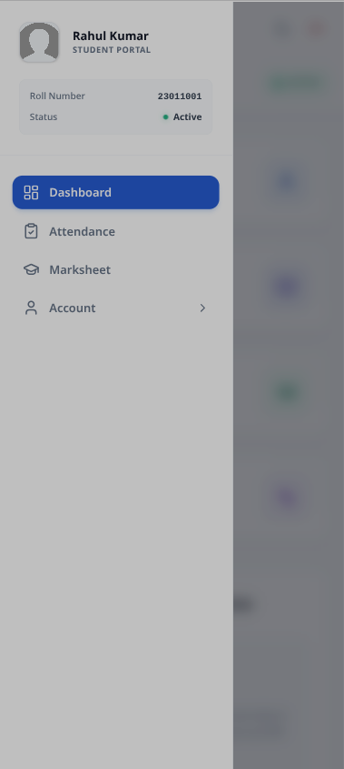 | 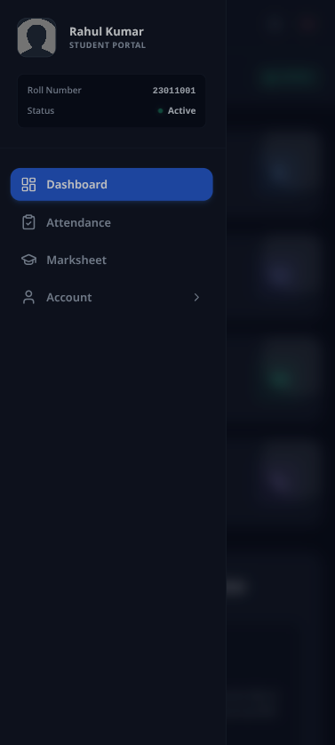 |

</details>

---

## 👥 Team

Developed as part of the B.Tech (CSE) curriculum at **Government College of Engineering, Keonjhar**.

| Name | Role |
|---|---|
| **Ayusman Avisek Nanda** | Team Member |
| **Muna Samal** | Team Member |
| **Dibyasmita Mohapatra** | Team Member |
| **Debasish Kar** | Team Member |
| **Lipika Pati** | Team Member |

**Project Guide:** Prof. Santosh Kumar Meher
**Department:** Computer Science & Engineering
**Program:** B.Tech — 3rd Year, 6th Semester (2025–26)
**Institution:** Government College of Engineering, Keonjhar, Odisha

---

## 📄 License

This project is licensed for educational and non-commercial use only.

---

Made with ❤️ at **GCE Keonjhar** — 2025–26

⭐ If this project helped you, please give it a star on GitHub!
